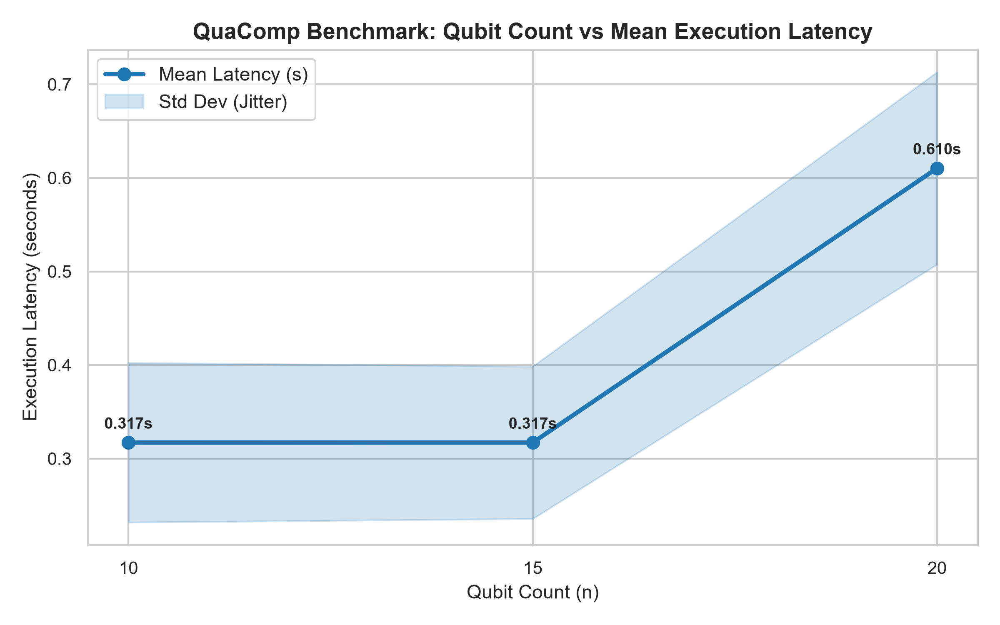
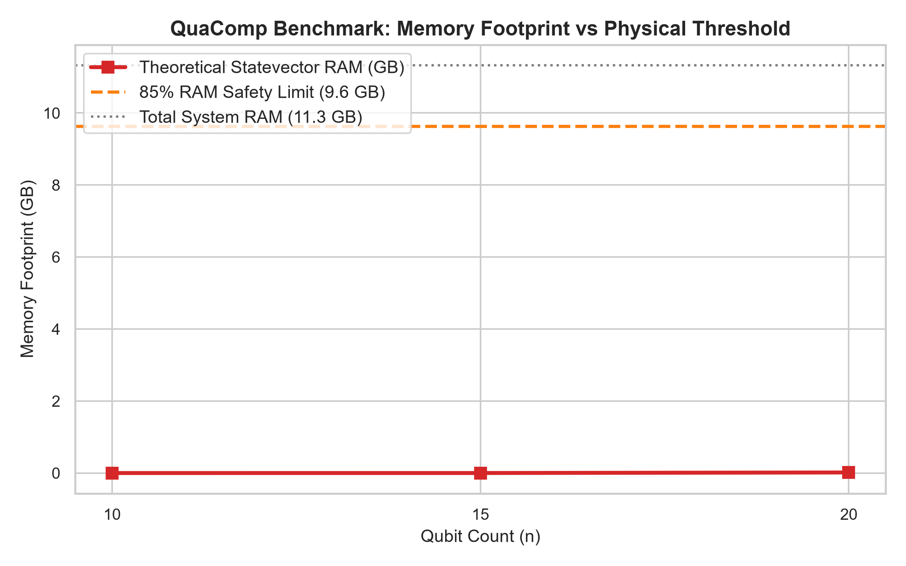

# QuaComp

```text
   ____             ____                     
  / __ \__  ______ / ___| ___  _ __ ___  _ __ 
 / / / / / / / __ `/ /   / _ \| '_ ` _ \| '_ \
/ /_/ / /_/ / /_/ / |__| (_) | | | | | | |_) |
\___\_\__,_/\__,_/\____/\___/|_| |_| |_| .__/ 
                                       |_|    
```

> **Quantum Computer Simulation Benchmark** — A modular Python utility designed to measure, stress-test, and profile quantum computer simulation limits on local hardware environments.

[](https://www.python.org/)
[](https://github.com/cybort18/QuaComp/actions)
[](#running-tests)
[](LICENSE)

---

## Table of Contents
- [Overview](#overview)
- [Key Features](#key-features)
- [Project Architecture](#project-architecture)
- [Getting Started](#getting-started)
- [Usage Examples](#usage-examples)
- [Running Tests](#running-tests)
- [Reference Hardware Benchmarks](#reference-hardware-benchmarks)
- [Scoring Categories](#scoring-categories)
- [Roadmap](#roadmap)
- [Contribution Guide](#contribution-guide)
- [License](#license)

---

## Overview

**QuaComp** is an open-source tool and benchmarking suite developed to profile local machine performance during quantum circuit simulation. Supporting Statevector, Matrix Product State (MPS), GPU hardware acceleration, and Noisy Intermediate-Scale Quantum (NISQ) noise engines, QuaComp evaluates execution latencies, CPU/memory performance, state fidelity loss, and calculates consistent metrics defined by QuaComp for comparative profiling across local environments.

### Benchmark Telemetry Showcase

When executed with the `--chart` flag, QuaComp generates high-DPI visualization plots of execution telemetry:

| Execution Latency Scaling (Mean ± Std Dev) | Memory Footprint & RAM Safety Threshold |
| :---: | :---: |
|  |  |

---

## Key Features

### Pre-flight Memory & VRAM Safety (Phase 1 & Phase 8)
- Computes estimated memory requirements prior to statevector simulation runs using:
  $$\text{RAM Bytes} = 2^n \times 16 \text{ bytes (for complex128 representation)}$$
- Integrates with `psutil` and GPU telemetry to dynamically inspect physical system memory and GPU VRAM.
- Blocks and warns simulations exceeding 85% of available RAM or GPU VRAM to prevent OS crashes and Out-Of-Memory (OOM) situations.

### Quantum Workload Generators (Phase 1)
- **Shallow Workloads**: Initial state allocations using Hadamard gates coupled with 1D entanglement (CNOT chains).
- **Deep Workloads**: Intensive random rotation matrices ($R_x, R_y, R_z$) and multi-layered entanglement chains designed to stress memory bandwidth.
- **Quantum Fourier Transform (QFT)**: Standard implementation representing realistic quantum algorithms.

### Multi-Engine Simulator Core (Phase 1, Phase 4 & Phase 8)
- **Statevector Simulation Engine**: Exact statevector simulation method (`AerSimulator(method='statevector')`).
- **Matrix Product State (MPS) Engine**: Tensor network simulation engine (`AerSimulator(method='matrix_product_state')`) enabling high-qubit simulation ($30\text{--}100+$ qubits) specifically for circuits with low-to-moderate entanglement using custom bond dimensions (`--bond-dim`, default 64).
- **GPU Acceleration Engine**: Hardware-accelerated quantum simulation using GPU compute devices (`--device gpu` / `--gpu`) with automatic VRAM safety validation and graceful fallback.
- **RAM Efficiency Profiling**: Calculates exact memory savings achieved by MPS compared to theoretical statevector memory footprint ($2^n \times 16$ bytes).

### NISQ Noise & Fidelity Profiler (Phase 5)
- **Synthetic Parameterized Noise Channels**: Incorporates Thermal Relaxation ($T_1, T_2$) and Depolarizing Errors using `qiskit_aer.noise`.
- **Preset Noise Profiles**: Configurable noise presets via `--noise-level [none|low|medium|high]`:
  - `none`: Ideal noise-free simulation.
  - `low`: Mild decoherence ($T_1=100\,\mu\text{s}, T_2=120\,\mu\text{s}$, gate error $0.1\%$).
  - `medium`: Synthetic representative noise profile ($T_1=50\,\mu\text{s}, T_2=70\,\mu\text{s}$, gate error $0.5\%$).
  - `high`: Heavy noise profile for extreme stress testing ($T_1=20\,\mu\text{s}, T_2=30\,\mu\text{s}$, gate error $2.0\%$).
- **Fidelity & Overhead Metrics**: Computes classical Hellinger Quantum State Fidelity (%) and CPU Computation Overhead ratio (%).

### Multi-Run Benchmarking & Telemetry (Methodology Revision)
- **Statistical Repeatability**: Executes `--runs INT` (default 3) benchmark iterations per circuit to compute Mean ($\mu$), Median, and Standard Deviation ($\sigma$) of execution latency, mitigating CPU governor and background task noise.
- **Composite Heuristic Scoring**: Computes the **QuaComp Composite Score** (a project-specific heuristic score) that separates state-space capacity from gate throughput:
  $$\text{Score} = (C \times 10) + T = (2^{\text{max qubits}} \times 10) + \left(\frac{\text{Total Gates}}{\mu_{\text{latency}}}\right)$$
  - **Capacity Metric ($C = 2^{\text{max qubits}}$)**: Qubit state-space capacity metric.
  - **Throughput Metric ($T = \frac{\text{Total Gates}}{\mu_{\text{latency}}}$)**: Gate processing throughput metric (gates/second).
  *Note: QuaComp Score is a project-specific composite heuristic prioritizing state-space capacity scaling.*

### Visualization Engine & Chart Generator (Phase 6)
- **Automated Plot Generation**: Passing `--chart` automatically generates 4 high-DPI (300 DPI) PNG charts in `results/`:
  - `qubit_vs_latency.png`: Line plot of Qubits vs Mean Latency (seconds) with standard deviation error shading.
  - `qubit_vs_ram.png`: Line plot of Qubits vs Memory Allocation (GB) with physical RAM safety threshold line.
  - `method_comparison.png`: Comparison bar chart between Statevector vs MPS latency & memory.
  - `noise_fidelity_impact.png`: Bar plot comparing NISQ noise profiles vs Quantum State Fidelity (%) & CPU Overhead (%).
- **Markdown Report Embedding**: Automatically links and embeds generated chart graphics into `results/report.md`.

### Relative Benchmark Comparison Engine (v1.5.0)
- **Side-by-Side Differencing**: Compares two benchmark JSON runs (or live benchmark against a target reference baseline) using `quacomp --compare`.
- **Metrics Evaluated**:
  - **Composite Score Ratio & Delta**: Relative speed and capacity gain percentage.
  - **Throughput Speedup Factor**: Direct gate simulation throughput ratio ($T_{target} / T_{base}$).
  - **Qubit Capacity Gap**: Physical qubit scaling difference ($2^{\Delta n}\times$ statevector space).
  - **Per-Qubit Latency Differencing**: Execution latency speedup multipliers and percentage savings.
- **Rich Terminal Comparison & Exporters**: Displays side-by-side colorized Rich tables and an academic verdict in terminal, while exporting `results/comparison.json`, `results/comparison_report.md`, and comparison plots (`qubit_latency_comparison.png`, `throughput_comparison.png`).

### JSON & Markdown Exporters (Phase 3)
- Automatically serializes run telemetry and statistical summaries to `results/benchmark_<timestamp>.json`.
- Exports readable summary reports to `results/report.md` formatted for GitHub issues or discussions.

---

## Project Architecture

```text
QuaComp/
├── .github/
│   └── workflows/
│       └── ci.yml          # GitHub Actions CI matrix (Ubuntu, Windows, macOS across Python 3.10-3.13)
├── cli/
│   ├── __init__.py
│   ├── __main__.py
│   └── main.py             # Rich terminal GUI CLI entry point (supports --method, --device, --gpu, --compare, --chart)
├── src/
│   ├── comparator/
│   │   ├── __init__.py
│   │   ├── differ.py       # Relative mathematical comparison engine & target resolver
│   │   └── reporter.py     # Comparison Rich tables, Markdown & JSON exporters
│   ├── engine/
│   │   ├── __init__.py
│   │   ├── circuits.py     # Circuit generators (Shallow, Deep, QFT)
│   │   ├── mps.py          # MPS configuration & RAM savings profiler
│   │   ├── noise.py        # NISQ noise presets & state fidelity calculator
│   │   └── simulator.py    # Aer Simulator wrapper (CPU/GPU, Statevector, MPS, Noise, Multi-run)
│   ├── profiler/
│   │   ├── __init__.py
│   │   ├── memory.py       # Pre-flight RAM & VRAM memory safety estimator
│   │   ├── gpu.py          # GPU hardware discovery, VRAM telemetry, & Aer device probe
│   │   └── telemetry.py    # CPU, OS, and platform hardware telemetry profiler
│   ├── scorer/
│   │   ├── __init__.py
│   │   └── calculator.py   # Benchmark scorer engine & breakdown calculator
│   └── reporter/
│       ├── __init__.py
│       ├── charts.py       # Visualization Engine & Chart Generator (Benchmark & Comparison plots)
│       ├── json_exporter.py# Save results & statistics in JSON format
│       └── md_exporter.py  # Save reports & chart links in Markdown format
├── tests/
│   ├── test_engine.py      # Circuit and simulation execution tests
│   ├── test_memory.py      # Memory limits and checker tests
│   ├── test_gpu.py         # GPU hardware detection, VRAM safety, and device execution tests
│   ├── test_scorer.py      # Score calculations & breakdown tests
│   ├── test_reporter.py    # Exporters files creation tests
│   ├── test_mps.py         # Matrix Product State (MPS) logic tests
│   ├── test_noise.py       # NISQ noise models and state fidelity tests
│   ├── test_charts.py      # Visualization engine and PNG plot tests
│   └── test_comparator.py  # Relative benchmark comparison & differencing tests
├── pyproject.toml          # PEP 517/621 Modern build configuration & executable entry point (v1.5.0)
├── setup.py                # Setuptools compatibility shim
├── requirements.txt        # Package dependencies (psutil, qiskit, rich, matplotlib, seaborn)
├── PRD.md                  # Product Requirement Document (v1.5.0)
├── README.md               # Project documentation
└── .gitignore              # Git ignore file
```

---

## Getting Started

### 1. Clone the repository
```bash
git clone https://github.com/cybort18/QuaComp.git
cd QuaComp
```

### 2. Install QuaComp
Install QuaComp in editable mode:
```bash
pip install -e .
```
*(Or install requirements directly via `pip install -r requirements.txt`)*

---

## Usage Examples

### Running the `quacomp` CLI Command

After installing, the `quacomp` command is available directly in your terminal:

```bash
# Run a quick benchmark on qubits 10, 15, and 20 with chart generation enabled
quacomp --quick --chart

# Run a quick benchmark with GPU acceleration
quacomp --quick --gpu

# Run a full incremental stress test starting from 10 qubits with 5 statistical runs
quacomp --full --runs 5 --chart

# Compare two benchmark JSON files side-by-side with comparison charts
quacomp --compare results/samples/example_ryzen3_5300u.json results/samples/example_apple_m3.json --chart
```

> *Tip: You can also execute via `python -m cli` if preferred.*

### Command Flags Reference

| Flag | Options / Default | Description |
| :--- | :--- | :--- |
| `--quick` | N/A | Runs benchmark suite on 10, 15, and 20 qubits. |
| `--full` | N/A | Incremental stress test starting from 10 qubits. |
| `--custom` | N/A | Custom simulation mode with specific qubit parameters. |
| `--compare` | `[FILE1] [FILE2]` | Side-by-side relative benchmark comparison between two JSON runs or against a live run. |
| `--target` | `apple_m3`, `ryzen3_5300u`, `ryzen7_5800h`, or `PATH` | Target reference baseline alias or file path for `--compare`. |
| `--device` | `cpu`, `gpu` (default: `cpu`) | Compute device backend for quantum simulation. |
| `--gpu` | N/A | Shorthand flag to enable GPU acceleration (`--device gpu`). |
| `--qubits` | `INT` (default: `10`) | Qubit count for custom simulation run. |
| `--type` | `shallow`, `deep`, `qft` (default: `qft`) | Quantum circuit workload type. |
| `--depth` | `INT` (default: `10`) | Depth parameter for deep random circuit workloads. |
| `--method` | `statevector`, `mps` (default: `statevector`) | Simulation engine method. |
| `--bond-dim` | `INT` (default: `64`) | Maximum bond dimension for MPS tensor network engine. |
| `--noise-level` | `none`, `low`, `medium`, `high` (default: `none`) | NISQ synthetic noise preset level. |
| `--runs` | `INT` (default: `3`) | Number of benchmark iterations per circuit for statistical mean/std calculation. |
| `--chart` | N/A | Automatically generates PNG telemetry chart plots in `results/`. |
| `--export` | `json`, `md`, `all` (default: `all`) | Benchmark report output format. |

---

## Running Tests

Automated unit tests are written with `pytest`. They cover statevector simulation, GPU detection & safety, multi-run latency statistics, MPS tensor compression, NISQ synthetic noise models, relative benchmark comparison, scoring breakdown, report exporters, and chart generation.

To execute the full test suite, run:
```bash
python -m pytest
```

Output:
```text
============================= test session starts =============================
platform win32 -- Python 3.13.3, pytest-9.1.1, pluggy-1.6.0
rootdir: C:\Users\HP\Documents\PROJECT\QuaComp
configfile: pyproject.toml
collected 47 items

tests\test_charts.py ...                                                 [  6%]
tests\test_comparator.py .......                                         [ 21%]
tests\test_engine.py .....                                               [ 31%]
tests\test_gpu.py .........                                              [ 51%]
tests\test_memory.py .....                                               [ 61%]
tests\test_mps.py ....                                                   [ 70%]
tests\test_noise.py ....                                                 [ 78%]
tests\test_reporter.py ....                                              [ 87%]
tests\test_scorer.py ......                                              [100%]

============================= 47 passed in 14.69s =============================
```

---

## Reference Hardware Benchmarks

The repository includes committed sample benchmark telemetry files in `results/samples/` representing performance across reference hardware platforms:

| Reference CPU | Total RAM | Max Qubits (SV) | QuaComp Composite Score | Performance Category | Sample JSON File |
| :--- | :---: | :---: | :---: | :---: | :--- | :--- |
| **AMD Ryzen 3 5300U** | 11.33 GB | 20 Qubits | `10,486,120.47` | High-Performance | [`example_ryzen3_5300u.json`](results/samples/example_ryzen3_5300u.json) |
| **AMD Ryzen 7 5800H** | 16.00 GB | 24 Qubits | `167,772,480.00` | Extreme Workstation | [`example_ryzen7_5800h.json`](results/samples/example_ryzen7_5800h.json) |
| **Apple M3 (8-core)** | 24.00 GB | 25 Qubits | `335,544,830.00` | Extreme Workstation | [`example_apple_m3.json`](results/samples/example_apple_m3.json) |

---

## Scoring Categories

QuaComp Composite Score maps directly into performance tiers, reflecting the computing capabilities of local environments:

| Tier Category | Score Range (Points) | Max Qubits Simulation Range |
| :--- | :--- | :--- |
| **Entry-Level** | $< 100,000$ | Up to 18-20 Qubits |
| **Mid-Range** | $100,000$ to $1,000,000$ | Up to 22-25 Qubits |
| **High-Performance** | $1,000,000$ to $50,000,000$ | Up to 26-28 Qubits |
| **Extreme Workstation** | $> 50,000,000$ | $29+$ Qubits |

> **Methodology Note on Capacity Dominance:**  
> Because state-vector memory allocation scales exponentially ($2^n$), the Capacity Metric ($10 \times 2^n$) exponentially dominates the Throughput Metric ($T = \text{gates}/\mu$). A system simulating 30 qubits will score higher than a system simulating 28 qubits with faster gate throughput, reflecting QuaComp's deliberate design choice to prioritize state-space memory capacity scaling over execution speed.

---

## Roadmap

- [x] **Phase 1: Core Simulation & Safety**
  - Implement memory safety checks.
  - Implement circuit workload generators (Shallow, Deep, QFT).
  - Integrate Aer simulator execution & time tracking.
  - Build out unit test coverage.
- [x] **Phase 2: Scoring & CLI Interface**
  - Implement benchmark scoring algorithms ("QuaComp Score").
  - Create interactive terminal GUI using the `rich` library.
- [x] **Phase 3: Exporters & Reports**
  - Add JSON / Markdown export features.
  - Publish documentation.
- [x] **Phase 4: Matrix Product State (MPS) Engine**
  - High-qubit simulation capabilities ($30\text{--}100+$ qubits for low-to-moderate entanglement).
  - Parameterizable bond dimension (`--bond-dim`).
  - Memory efficiency savings profiler.
- [x] **Phase 5: NISQ Noise & Fidelity Benchmarking**
  - Qiskit Aer synthetic noise channel integration ($T_1/T_2$ relaxation & depolarizing error).
  - Customizable noise presets (`--noise-level [none|low|medium|high]`).
  - Quantum State Fidelity (%) & CPU Computation Overhead (%) tracking.
- [x] **Methodological Revision Phase**
  - Multi-run statistical benchmarking (`--runs INT`, Mean, Median, Std Dev).
  - Scoring breakdown (Capacity Metric $C$ & Throughput Metric $T$).
  - Softened academic terminology across documentation.
- [x] **Phase 6: Visualization Engine & Chart Generator**
  - Matplotlib & Seaborn integration (`--chart`).
  - Automated generation of `qubit_vs_latency.png`, `qubit_vs_ram.png`, `method_comparison.png`, `noise_fidelity_impact.png`.
  - Chart embedding in Markdown reports (`results/report.md`).
- [x] **Phase 7: Packaging & CI/CD Pipeline (v1.5.0)**
  - PEP 517/621 `pyproject.toml` build system & `quacomp` executable CLI entry point.
  - Multi-platform GitHub Actions CI matrix running automated `pytest` across Ubuntu, Windows, and macOS on Python 3.10–3.13.
- [x] **Phase 8: Relative Comparison & GPU Acceleration Support (v1.5.0)**
  - Relative benchmark differencing engine (`--compare`) with side-by-side tables and verdict.
  - GPU hardware detection, VRAM safety evaluation, and simulation backend (`--device gpu` / `--gpu`).
  - Comparison charts (`qubit_latency_comparison.png` and `throughput_comparison.png`).

---

## Contribution Guide

Contributions are welcome! Please follow these steps to contribute:
1. Fork the Project.
2. Create your Feature Branch (`git checkout -b feature/AmazingFeature`).
3. Commit your Changes (`git commit -m 'Add some AmazingFeature'`).
4. Push to the Branch (`git push origin feature/AmazingFeature`).
5. Open a Pull Request.

Make sure to run the `pytest` test suite before submitting pull requests to verify all system features remain functional.

---

## License

This project is licensed under the MIT License - see the LICENSE file for details.
