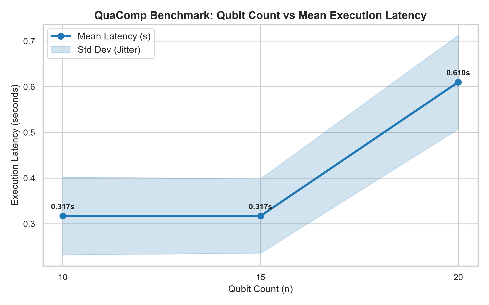
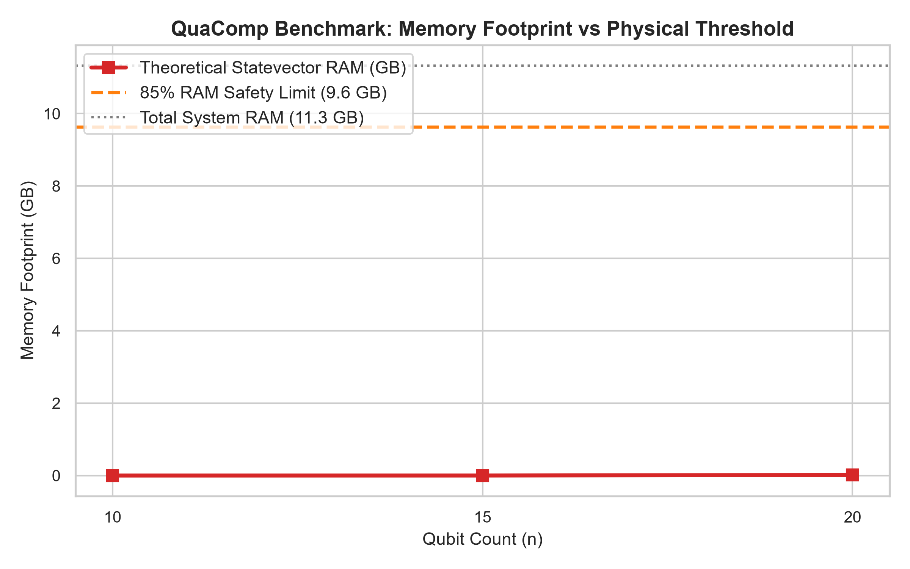

<div align="center">
<pre align="center">
   ____             ____                     
  / __ \__  ______ / ___| ___  _ __ ___  _ __ 
 / / / / / / / __ `/ /   / _ \| '_ ` _ \| '_ \
/ /_/ / /_/ / /_/ / |__| (_) | | | | | | |_) |
\___\_\__,_/\__,_/\____/\___/|_| |_| |_| .__/ 
                                       |_|    
</pre>
</div>

# QuaComp

> **Quantum Computer Simulation Benchmark** — A modular Python utility designed to measure, stress-test, and profile quantum computer simulation limits on local hardware environments.

[](https://www.python.org/)
[](https://github.com/cybort18/QuaComp/actions)
[](#running-tests)
[](LICENSE)


---

## Table of Contents
- [Overview](#overview)
- [Key Features](#key-features)
- [Project Architecture](#project-architecture)
- [Getting Started & C++ Compilation](#getting-started--c-compilation)
- [Hardware Compatibility Matrix](#hardware-compatibility-matrix)
- [Usage Examples](#usage-examples)
- [Running Tests](#running-tests)
- [Reference Hardware Benchmarks](#reference-hardware-benchmarks)
- [Scoring & Dual-Mode Benchmark System](#scoring--dual-mode-benchmark-system)
- [Technical Limitations & Architecture Transparency](#technical-limitations--architecture-transparency)
- [Roadmap](#roadmap)
- [Contribution Guide](#contribution-guide)
- [License](#license)

---

## Overview

**QuaComp** is an open-source tool and benchmarking suite developed to profile local machine performance during quantum circuit simulation. Supporting Statevector, Matrix Product State (MPS), GPU & Multi-GPU hardware acceleration, distributed worker parallelism, and Noisy Intermediate-Scale Quantum (NISQ) noise engines, QuaComp evaluates execution latencies, CPU/memory performance, state fidelity loss, and calculates consistent metrics defined by QuaComp for comparative profiling across local environments.

---

## Key Features

### Pre-flight Safety Guard & Memory Threshold Estimation
- Estimates statevector memory requirements prior to simulation runs using:
  $$\text{RAM Bytes} = 2^n \times 16 \text{ bytes (for complex128 representation)}$$
- Evaluates available physical RAM and GPU/Multi-GPU aggregate VRAM using `psutil` and device telemetry.
- Dynamically blocks and warns on workloads exceeding 85% of available RAM or GPU VRAM, preventing Out-Of-Memory (OOM) fatal crashes and system freezing.

### Dual Simulation Engines (Statevector & Matrix Product State)
- **Statevector Simulation Engine**: Full exact quantum statevector representation of $2^n$ complex amplitudes for high-accuracy circuit analysis.
- **Matrix Product State (MPS) Engine**: Tensor network compression with configurable bond dimension $\chi \le 64, 128$ to simulate large-scale quantum circuits (30 to 100+ qubits) with up to **99.9% RAM savings** on memory-constrained hardware.
- **RAM Efficiency Profiling**: Measures actual physical RAM allocation and benchmarks against theoretical statevector memory footprint of $2^n \times 16$ bytes.

### Hardware Acceleration & Distributed Model Parallelism
- Automatically detects GPU hardware (NVIDIA, AMD, Apple, Intel) and queryable VRAM limits.
- Supports Qiskit Aer GPU/CUDA acceleration (`quacomp --gpu` or `quacomp --device gpu`).
- Supports Multi-GPU acceleration pooling (`quacomp --multi-gpu` / `--device multi_gpu`) with batched shot memory distribution and aggregate VRAM scaling.
- **Distributed Statevector Slicing (Model Parallelism)**: Combines VRAM from multiple GPUs via distributed chunk streaming (`--state-slicing`, `--blocking-qubits <INT>`), enabling large statevectors with $n > 28$ qubits that exceed single-card VRAM limits. *(Note: Slicing is coordinated at the Python process level through Qiskit Aer chunk streaming; inter-chunk operations transfer data over PCIe/NVLink buses without bare-metal MPI kernel fusion).*
- Supports Distributed Multi-Worker parallel simulation execution (`quacomp --workers <INT>`) across multi-core CPUs and GPU compute backends.
- Graceful, informative diagnostics and fallback if GPU execution is requested on a CPU-only environment.

### Native Kernel Acceleration & Hardware Compute Engines (`--use-native-kernels`, `--backend`)
- **Single-Pass Gate Fusion Engine**: Fuses sequential multi-gate subcircuits on identical or adjacent qubits into consolidated unitary matrices:
  $$U_{\text{fused}} = U_k \times U_{k-1} \times \dots \times U_1$$
- **NVIDIA CUDA Native Engine (`src/engine/cuda/fusion.cu`)**: Custom high-performance CUDA kernels for $2^n$ statevector manipulation using 128-bit `cuDoubleComplex` with coalesced global memory access, unrolled 1-qubit / 2-qubit bit twiddling, and multi-tier runtime integration (CuPy `RawKernel` / PyTorch CUDA Stream).
- **Apple Metal Shaders (`fusion.metal`)**: Metal Performance Compute Shaders executing unitary gate fusion on Apple Silicon GPU pipelines.
- **C++ SIMD Extension (`quacomp_cpp`)**: Pybind11-compiled optimized C++ kernels featuring unrolled single-pass $2\times 2$ and $4\times 4$ complex matrix multiplications and Kronecker tensor products.
- **Multi-Tier Graceful Fallback**: Automatically dispatches kernels across a multi-tier hierarchy:
  $$\text{NVIDIA CUDA GPU} \longrightarrow \text{Apple Metal GPU} \longrightarrow \text{C++ Native SIMD Engine} \longrightarrow \text{Pure CPython / NumPy Fallback}$$

### Diverse Quantum Workload Generators
- **Shallow Workloads**: Initial state allocations using Hadamard gates coupled with 1D entanglement (CNOT chains).
- **Deep Workloads**: Intensive random rotation matrices $R_x, R_y, R_z$ and multi-layered entanglement chains designed to stress memory bandwidth.
- **Quantum Fourier Transform (QFT)**: Standard implementation representing realistic quantum algorithms.
- **Variational Quantum Eigensolver (VQE)**: Parametric ansatz (`quacomp --vqe`) with alternating $R_y$ layers and linear/full entanglement, featuring automatic Parameter Binding latency and throughput profiling.
- **Quantum Approximate Optimization Algorithm (QAOA)**: Max-Cut parametric ansatz (`quacomp --qaoa`) parameterized by cost $\gamma$ and mixer $\beta$ Hamiltonians.
- **Quantum Volume (QV)**: Square model circuits (`quacomp --qv`) with Haar-random $SU(4)$ 2-qubit unitaries on random qubit permutations per layer, accompanied by Heavy Output Generation Probability analysis where $h_{\text{prob}} > 2/3$ and $2\sigma$ confidence certification.

### OpenQASM 2.0 Parser & Standard Circuit Interoperability (`--qasm`)
- **Zero-Overhead Lightweight Parser**: Standalone native lexer, tokenizer, and safe AST evaluator supporting the official OpenQASM 2.0 specification without bulky external parser dependencies.
- **Comprehensive Standard Gate Set**: Full parsing and synthesis for 1-qubit gates (`h`, `x`, `y`, `z`, `s`, `sdg`, `t`, `tdg`, `rx`, `ry`, `rz`, `u1`, `u2`, `u3`), 2-qubit gates (`cx`/`cnot`, `cz`, `cy`, `ch`, `swap`, `iswap`, `crz`, `cu1`, `cu3`, `rxx`, `ryy`, `rzz`), and 3-qubit gates (`ccx`/`toffoli`, `cswap`/`fredkin`).
- **Safe Mathematical Parameter Expressions**: AST-based arithmetic evaluator for rotation angles supporting `pi`, algebraic operators (`+`, `-`, `*`, `/`, `**`, `^`), and safe standard functions (`sin`, `cos`, `tan`, `exp`, `ln`, `sqrt`).
- **Gate Macro Expansion & Register Broadcasting**: Seamlessly handles user-defined custom gate macros (`gate ... { ... }`) and expands register-wide broadcast statements (e.g. `h q;` on `qreg q[4];`).
- **Bi-Directional Qiskit Interoperability**: Direct translation to executable `QuantumCircuit` and seamless constructor from existing Qiskit circuits via `ParsedQASMCircuit.from_qiskit()`.
- **Pre-bundled QASMBench Suite**: Includes standard benchmark fixtures in `benchmarks/` (`bell_state.qasm`, `teleportation.qasm`, `ghz_state.qasm`, `qft_4qubit.qasm`).

### NISQ Noise & State Fidelity Profiler
- **Synthetic Parameterized Noise Channels**: Incorporates Thermal Relaxation $T_1, T_2$ and Depolarizing Errors using `qiskit_aer.noise`.
- **Preset Noise Profiles**: Configurable noise presets via `--noise-level [none|low|medium|high]`:
  - `none`: Ideal noise-free simulation.
  - `low`: Mild decoherence: $T_1 = 100\,\mu\text{s}, T_2 = 120\,\mu\text{s}$, gate error rate 0.1%.
  - `medium`: Representative synthetic noise: $T_1 = 50\,\mu\text{s}, T_2 = 70\,\mu\text{s}$, gate error rate 0.5%.
  - `high`: Heavy noise profile for extreme stress testing: $T_1 = 20\,\mu\text{s}, T_2 = 30\,\mu\text{s}$, gate error rate 2.0%.
- **Fidelity & Overhead Metrics**: Computes classical Hellinger Quantum State Fidelity (%) and CPU Computation Overhead ratio (%).

### Real Physical QPU Noise Models & Kraus Operators (`--noise-profile`)
- **Direct Physical QPU Calibration Ingestion**: Imports raw hardware calibration snapshots from production superconducting QPUs (such as IBM Quantum 127-qubit Brisbane / Eagle and Rigetti architectures).
- **Physical Parameter Extraction**: Extracts qubit-specific thermal relaxation $T_1$, dephasing $T_2$, readout assignment error confusion matrices $P(\text{read}|\text{true})$, and single/two-qubit gate fidelities.
- **Analytical Trace-Preserving Kraus Representation**: Analytically computes complete trace-preserving Kraus operators:
  $$\mathcal{E}(\rho) = \sum_k E_k \rho E_k^\dagger, \quad \text{where} \quad \sum_k E_k^\dagger E_k = I$$
  - **Amplitude Damping** ($\gamma = 1 - e^{-t/T_1}$):
    $$E_0 = |0\rangle\langle 0| + \sqrt{1-\gamma}|1\rangle\langle 1|, \quad E_1 = \sqrt{\gamma}|0\rangle\langle 1|$$
  - **Phase Damping** ($\lambda = 1 - e^{-2t/T_\phi}$):
    $$E_0 = |0\rangle\langle 0| + \sqrt{1-\lambda}|1\rangle\langle 1|, \quad E_1 = \sqrt{\lambda}|1\rangle\langle 1|$$
  - **Combined Thermal Relaxation & Readout Confusion**: Rigorously bounded such that $T_2 \le 2T_1$, preventing unphysical negative rates.
- **Seamless Aer Simulation**: Converts calibration profiles directly into executable Qiskit Aer `NoiseModel` instances for realistic NISQ benchmarking against ideal statevectors.

### Monte Carlo Wavefunction (Quantum Trajectories) Noise Simulation (`--noise-method trajectory`, `--shots`)
- **Memory Scaling Preservation**: Replaces density matrix exponential memory explosion ($\mathcal{O}(4^n) = \mathcal{O}(2^{2n})$) with stochastic quantum trajectories maintaining $\mathcal{O}(2^n)$ statevector scaling.
- **Overcoming the Density Matrix Barrier**: Standard 16 GB RAM workstations can now simulate noisy circuits up to **28 qubits** (requiring only ~4 GB RAM), breaking through the classical 14-qubit density matrix ceiling.
- **Stochastic Quantum Jumps**: Evaluates Kraus channels via branch probability sampling and in-place wave function collapse and renormalization:

$$p_k = \langle \psi | K_k^\dagger K_k | \psi \rangle, \quad |\psi'\rangle = \frac{K_j |\psi\rangle}{\sqrt{p_j}}$$

- **NISQ Noise Channels Supported**:
  - **Depolarizing Noise**: In-place stochastic Pauli errors ($X, Y, Z$) applied per gate.
  - **Thermal Relaxation ($T_1, T_2$)**: In-place amplitude damping jumps ($|1\rangle \to |0\rangle$ with probability $1 - e^{-t_g / T_1}$) and pure dephasing phase flips ($Z$ with probability $(1 - e^{-t_g / T_\phi})/2$).
  - **Readout Mitigation & Stochastic Bit-Flip**: Post-measurement bit-flips modeled via readout confusion matrices $P(\text{read}|\text{true})$.
- **Ensemble Averaging & Observables**: Aggregates output bitstring distributions across configurable shots ($N_{\text{shots}}$, default 1000) to reproduce exact NISQ expectation values:

$$\langle O \rangle = \frac{1}{N_{\text{shots}}} \sum_{s=1}^{N_{\text{shots}}} \langle \psi_s | O | \psi_s \rangle$$

- **Pre-Flight Density Matrix Safety Guard**: Automatically halts execution if `--noise-method density_matrix` is requested for $n \ge 16$ qubits on systems with $\le 32\text{ GB}$ RAM, preventing fatal system Out-Of-Memory crashes.

### Entanglement Entropy & MPS Topology Optimization (`--entropy`)
- **Native MPS Tensor Bond SVD & Statevector SVD**: Seamlessly switches between full Statevector SVD for $n \le 22$ and local 1D Tensor Network MPS Central Bond SVD for $n > 22$, enabling exact Entanglement Entropy analysis for **30 to 100+ qubit circuits** in under 0.2 seconds with under 2 MB RAM consumption.
- **Dynamic Permutation Tracking & Deferred Routing**: Optimizes MPS topological routing with `_PermutedMPSChain`, tracking virtual-to-physical qubit locations to eliminate naive SWAP ping-pong and minimize 2-qubit tensor contractions.
- **SVD Truncation Error Monitoring**: Dynamically tracks cumulative truncation error to ensure simulation fidelity bounds:
  $$\epsilon_{\text{trunc}} = \sum \left(1 - \sum_{i \le \chi} \lambda_i^2\right)$$
- **Bipartite Von Neumann Entanglement Entropy**:
  $$S(\rho_A) = -\text{Tr}(\rho_A \log_2 \rho_A) = -\sum_{i} \lambda_i^2 \log_2(\lambda_i^2)$$
- **Schmidt Rank & Participation Ratio**: Quantifies the effective number of entangled states $K$ and Schmidt spectrum rank:
  $$K = \frac{1}{\sum_i \lambda_i^4}$$
- **Simulation Complexity Classification**: Classifies entanglement regimes into `Product State`, `Low (Area-law)`, `Moderate`, and `Volume-law (Maximal)` alongside MPS simulation hardness tiers (`Trivial`, `Efficient`, `Challenging`, `Exponentially Hard`).

### Hardware Power & Energy Telemetry (EQO)
- **Cross-Platform Energy Profiling**: Automatically interfaces with Linux RAPL (`/sys/class/powercap/intel-rapl`), macOS power counters, or continuous Windows/generic dynamic TDP integration models:
  $$P(t) = P_{\text{idle}} + U(t) \times (P_{\text{TDP}} - P_{\text{idle}})$$
- **Sensor Transparency Badges**: Clearly identifies the origin of power data via CLI and Markdown report tags: `[Sensor: RAPL]` for direct hardware counters vs `[Sensor: TDP Estimate]` for dynamic TDP mathematical estimations. *(Note: Linux RAPL sysfs counters require root or read privileges; QuaComp automatically and gracefully falls back to dynamic TDP modeling on unprivileged user accounts).*
- **Energy per Quantum Operation (EQO)**: Quantifies the energetic efficiency of simulation backends in Joules per gate (µJ/Gate), providing sustainability metrics alongside raw latency.

### Multi-Run Benchmarking & Telemetry
- **Statistical Repeatability**: Executes `--runs INT` (default 3) benchmark iterations per circuit to compute Mean (μ), Median, and Standard Deviation (σ) of execution latency, mitigating CPU governor and background task noise.
- **Composite Heuristic Scoring**: Computes the **QuaComp Composite Score** (a project-specific heuristic score) that separates state-space capacity from gate throughput:
  $$\text{Score} = (C \times 10) + T = (2^{\text{max qubits}} \times 10) + \left(\frac{\text{Total Gates}}{\mu_{\text{latency}}}\right)$$
  - **Capacity Metric**: $C = 2^{\text{max qubits}}$ (qubit state-space capacity metric).
  - **Throughput Metric**: $T = \frac{\text{Total Gates}}{\mu_{\text{latency}}}$ (gate processing throughput in gates/second).
  *Note: QuaComp Score is a project-specific composite heuristic prioritizing state-space capacity scaling.*

### Visualization Engine & Chart Generator
- Passing `--chart` automatically generates high-DPI (300 DPI) PNG charts in `results/`:
  - `qubit_vs_latency.png`: Line plot of Qubits vs Mean Latency (seconds) with standard deviation error shading.
  - `qubit_vs_ram.png`: Line plot of Qubits vs Memory Allocation (GB) with physical RAM safety threshold line.
  - `method_comparison.png`: Comparison bar chart between Statevector vs MPS latency & memory.
  - `noise_fidelity_impact.png`: Bar plot comparing NISQ noise profiles vs Quantum State Fidelity (%) & CPU Overhead (%).
  - `entanglement_entropy.png`: Scaling curve of Entanglement Entropy $S_{\text{vN}}$ vs theoretical maximum bipartite bound $S_{\max}$.
- Automatically links and embeds generated chart graphics into `results/report.md`.

| Execution Latency Scaling (Mean ± Std Dev) | Memory Footprint & RAM Safety Threshold |
| :---: | :---: |
|  |  |

### Relative Benchmark Comparison Engine
- **Side-by-Side Differencing**: Compares two benchmark JSON runs (or live benchmark against a target reference baseline) using `quacomp --compare`.
- **Metrics Evaluated**:
  - **Composite Score Ratio & Delta**: Relative speed and capacity gain percentage.
  - **Throughput Speedup Factor**: Direct gate simulation throughput ratio: $T_{\text{target}} / T_{\text{base}}$.
  - **Qubit Capacity Gap**: Physical qubit scaling difference of $2^{\Delta n}\times$ statevector space.
  - **Per-Qubit Latency Differencing**: Execution latency speedup multipliers and percentage savings.
- **Rich Terminal Comparison & Exporters**: Displays side-by-side colorized Rich tables and an academic verdict in terminal, while exporting `results/comparison.json`, `results/comparison_report.md`, and comparison plots (`qubit_latency_comparison.png`, `throughput_comparison.png`).

### JSON & Markdown Exporters
- Automatically serializes run telemetry and statistical summaries to `results/benchmark_<timestamp>.json`.
- Exports readable summary reports to `results/report.md` formatted for GitHub issues or discussions.

---

## Project Architecture

```text
QuaComp/
├── .github/
│   └── workflows/
│       └── ci.yml          # GitHub Actions CI matrix (Ubuntu, Windows, macOS across Python 3.10-3.13)
├── benchmarks/             # OpenQASM 2.0 industry-standard circuit fixtures
│   ├── bell_state.qasm     # 2-qubit maximally entangled Bell state
│   ├── ghz_state.qasm      # 3-qubit Greenberger-Horne-Zeilinger state
│   ├── qft_4qubit.qasm     # 4-qubit Quantum Fourier Transform
│   └── teleportation.qasm  # 3-qubit Quantum Teleportation protocol
├── cli/
│   ├── __init__.py
│   ├── __main__.py
│   ├── comparison.py       # Comparison mode CLI handler & workflow
│   ├── main.py             # Main CLI dispatcher & argument parser
│   └── runner.py           # Simulation runners (Quick, Full, Custom)
├── results/
│   ├── noise_profiles/     # Real physical QPU calibration data
│   │   └── ibm_brisbane_sample.json # Sample 127-qubit IBM Brisbane calibration
│   └── registry/           # Authoritative benchmark reference presets
├── src/
│   ├── comparator/
│   │   ├── __init__.py
│   │   ├── differ.py       # Relative mathematical comparison engine & target resolver
│   │   ├── registry.py     # Dynamic enterprise baseline registry & offline caching
│   │   └── reporter.py     # Comparison Rich tables, Markdown & JSON exporters
│   ├── engine/
│   │   ├── __init__.py
│   │   ├── accelerator.py  # Unified GPU (Metal/CUDA) and C++ accelerator dispatcher
│   │   ├── circuits.py     # Circuit generators (Shallow, Deep, QFT, VQE, QAOA, QV)
│   │   ├── cpp/            # C++ SIMD Native Gate Fusion Engine
│   │   │   ├── fusion.hpp  # High-performance complex matrix math declarations
│   │   │   └── fusion.cpp  # Pybind11 unrolled 2x2/4x4 fusion implementation
│   │   ├── cuda/           # NVIDIA CUDA GPU Acceleration Engine
│   │   │   ├── fusion.cuh  # CUDA kernel signatures & cuDoubleComplex math helpers
│   │   │   └── fusion.cu   # Coalesced 1Q/2Q gate kernels and gate fusion
│   │   ├── entanglement.py # Von Neumann Entanglement Entropy, MPS topology router, & SVD bounds
│   │   ├── fusion.py       # Single-pass gate fusion engine & fallback dispatcher
│   │   ├── mps.py          # MPS configuration & RAM savings profiler
│   │   ├── noise.py        # NISQ noise presets & state fidelity calculator
│   │   ├── parser.py       # OpenQASM 2.0 parser & circuit interoperability engine
│   │   ├── physical_noise.py # Real physical QPU noise parser & analytical Kraus generator
│   │   ├── shaders/        # GPU compute kernels
│   │   │   └── fusion.metal# Apple Metal compute shader for unitary gate fusion
│   │   └── simulator.py    # Aer Simulator wrapper (Native Kernels, Slicing, MPS, Multi-GPU)
│   ├── profiler/
│   │   ├── __init__.py
│   │   ├── energy.py       # Cross-platform hardware power, energy & EQO profiler
│   │   ├── memory.py       # Pre-flight RAM & VRAM memory safety estimator
│   │   ├── gpu.py          # GPU hardware discovery, VRAM telemetry, & Aer device probe
│   │   └── telemetry.py    # CPU, OS, and platform hardware telemetry profiler
│   ├── scorer/
│   │   ├── __init__.py
│   │   └── calculator.py   # Benchmark scorer engine & breakdown calculator
│   └── reporter/
│       ├── __init__.py
│       ├── charts.py       # Visualization Engine & Chart Generator (Benchmark & Comparison plots)
│       ├── json_exporter.py# Save results & statistics in JSON format
│       └── md_exporter.py  # Save reports & chart links in Markdown format
├── tests/
│   ├── test_accelerator.py # Hardware accelerator dispatcher & fallback tests
│   ├── test_charts.py      # Visualization engine and PNG plot tests
│   ├── test_comparator.py  # Relative benchmark comparison & differencing tests
│   ├── test_cpp_fusion.py  # C++ & Python gate fusion engine tests
│   ├── test_cuda.py        # NVIDIA CUDA backend detection, mock & live tests
│   ├── test_energy.py      # Hardware energy telemetry & EQO calculation tests
│   ├── test_engine.py      # Circuit and simulation execution tests
│   ├── test_entanglement.py# Entanglement entropy and Schmidt decomposition tests
│   ├── test_gpu.py         # GPU hardware discovery, VRAM safety, and device execution tests
│   ├── test_memory.py      # Memory limits and checker tests
│   ├── test_model_parallelism.py # Multi-GPU distributed statevector slicing tests
│   ├── test_mps.py         # Matrix Product State (MPS) logic tests
│   ├── test_mps_topology.py# MPS dynamic permutation routing and truncation tests
│   ├── test_native_integration.py # Native kernels & physical noise CLI integration tests
│   ├── test_noise.py       # NISQ noise models and state fidelity tests
│   ├── test_parser.py      # OpenQASM 2.0 parser, parameter math & statevector tests
│   ├── test_physical_noise.py # Real physical QPU noise calibration & Kraus tests
│   ├── test_registry.py    # Dynamic baseline registry & offline caching tests
│   ├── test_reporter.py    # Exporters files creation tests
│   ├── test_scorer.py      # Score calculations & breakdown tests
│   ├── test_ui.py          # Terminal UI & telemetry display tests
│   └── test_variational_qv.py # VQE, QAOA, and Quantum Volume verification tests
├── pyproject.toml          # PEP 517/621 Modern build configuration & executable entry point (v1.0.0)
├── setup.py                # Pybind11 C++ extension build configuration with optional fallback
├── requirements.txt        # Package dependencies (psutil, qiskit, rich, matplotlib, seaborn, pybind11)
├── PRD.md                  # Product Requirement Document (v1.0.0)
├── README.md               # Project documentation
└── .gitignore              # Git ignore file
```

---

## Getting Started & C++ Compilation

### 1. Clone the repository
```bash
git clone https://github.com/cybort18/QuaComp.git
cd QuaComp
```

### 2. Install QuaComp & Build C++ Extension
Install QuaComp in editable mode with automatic C++ native extension compilation:
```bash
pip install -e .
```

#### C++ Native Extension Compilation Details
- **Compiler Prerequisites (Optional for Acceleration):**
  - **Linux:** GCC 9+ or Clang 10+ (`sudo apt install build-essential python3-dev`)
  - **macOS:** Xcode Command Line Tools (`xcode-select --install`)
  - **Windows:** Microsoft Visual C++ (MSVC) Build Tools 2019/2022 (`Desktop development with C++`)
- **Automatic Graceful Fallback (`BuildExtOptional`):**  
  QuaComp's `setup.py` wraps Pybind11 compilation inside a non-blocking build hook. If a compatible C++ compiler is not present on the host system, the build continues smoothly and installs QuaComp in pure Python mode. At runtime, `src/engine/accelerator.py` automatically detects binary availability and dispatches computations to optimized CPython fallback algorithms without throwing fatal errors.

#### NVIDIA CUDA GPU Acceleration Setup (Optional for CUDA)
For NVIDIA GPU hardware acceleration (`--backend cuda`):
- **Prerequisites:**
  - NVIDIA GPU with Compute Capability 6.0+ (Pascal, Volta, Turing, Ampere, Ada Lovelace, Hopper, Blackwell).
  - NVIDIA Display Driver (525+ recommended) and CUDA Toolkit (11.8+ or 12.x).
- **Python CUDA Runtime Libraries:**
  - Install CuPy for your CUDA version (recommended):
    ```bash
    pip install cupy-cuda12x  # For CUDA 12.x
    # or: pip install cupy-cuda11x  # For CUDA 11.x
    ```
  - Alternatively, PyTorch with CUDA support:
    ```bash
    pip install torch --index-url https://download.pytorch.org/whl/cu121
    ```
- **Automatic Fallback:** If `--backend cuda` is requested on systems without NVIDIA hardware or CUDA runtime, QuaComp outputs an informative diagnostic notice and automatically falls back to Apple Metal, C++ SIMD, or NumPy without crashing.

---

## Hardware Compatibility Matrix

| Hardware Platform | Accelerator Engine | Backend Technology | Supported OS | Graceful Fallback Mode |
| :--- | :--- | :--- | :--- | :--- |
| **NVIDIA GPU (RTX / A100 / H100)** | CUDA GPU Acceleration | Native CUDA (fusion.cu) & CuPy/PyTorch | Linux, Windows | `[Engine: C++ SIMD]` → `[Engine: Python Fallback]` |
| **Apple Silicon (M1/M2/M3/M4)** | Metal GPU Compute | Apple Metal Shaders (fusion.metal) | macOS | `[Engine: C++ SIMD]` → `[Engine: Python Fallback]` |
| **x86_64 / ARM64 CPU (Modern)** | C++ Native SIMD | Pybind11 Unrolled Matrix Fusion | Linux, macOS, Windows | `[Engine: Python Fallback]` |
| **Any Generic CPU** | Pure CPython / NumPy | Vectorized NumPy Fallback Engine | All Platforms | Built-in Base Level |

---

## Usage Examples

### Running the `quacomp` CLI Command

After installing, the `quacomp` command is available directly in your terminal:

```bash
# Run a quick benchmark on qubits 10, 15, and 20 with chart generation enabled
quacomp --quick --chart

# Run a quick benchmark with native C++/Metal/CUDA gate fusion acceleration
quacomp --quick --use-native-kernels

# Run a simulation using the NVIDIA CUDA acceleration backend
quacomp --custom --qubits 24 --backend cuda

# Run a quick benchmark with real physical QPU noise calibration (IBM Brisbane)
quacomp --quick --noise-profile ibm_brisbane_sample

# Run a 20-qubit simulation with Monte Carlo Wavefunction quantum trajectories (1000 shots)
quacomp --custom --qubits 20 --noise-level medium --noise-method trajectory --shots 1000

# Run a quick benchmark with GPU acceleration
quacomp --quick --gpu

# Run distributed statevector slicing (model parallelism) across aggregated VRAM
quacomp --custom --qubits 28 --gpu --state-slicing --blocking-qubits 16

# Run variational VQE benchmark with parameter binding latency measurement
quacomp --custom --qubits 6 --vqe

# Run Quantum Volume benchmark with heavy output probability analysis
quacomp --custom --qubits 4 --qv

# Ingest and benchmark an industry-standard OpenQASM 2.0 circuit
quacomp --qasm benchmarks/bell_state.qasm --runs 3

# Synchronize enterprise baseline profiles from remote registry
quacomp --fetch-baselines

# Compare local live run against authoritative enterprise baseline
quacomp --quick --compare --target apple_m4_max
```

> *Tip: You can also execute via `python -m cli` if preferred.*

### Command Flags Reference

| Flag | Options / Default | Description |
| :--- | :--- | :--- |
| `--quick` | N/A | Runs benchmark suite on 10, 15, and 20 qubits. |
| `--full` | N/A | Incremental stress test starting from 10 qubits. |
| `--custom` | N/A | Custom simulation mode with specific qubit parameters. |
| `--compare` | `[FILE1] [FILE2]` | Side-by-side relative benchmark comparison between two JSON runs or against a live run. |
| `--target` | `apple_m3`, `apple_m4_max`, `nvidia_h100`, `aws_graviton4`, etc. | Target reference baseline alias or file path for `--compare`. |
| `--fetch-baselines` | N/A | Synchronize enterprise comparison baselines from QuaComp remote registry. |
| `--device` | `cpu`, `gpu`, `multi_gpu` (default: `cpu`) | Compute device backend for quantum simulation. |
| `--gpu` | N/A | Shorthand flag to enable GPU acceleration (`--device gpu`). |
| `--multi-gpu` | N/A | Enable multi-GPU distributed simulation backend (`--device multi_gpu`). |
| `--use-native-kernels` | N/A | Force native kernel acceleration (C++ SIMD / Apple Metal / CUDA Single-Pass Gate Fusion). |
| `--backend` | `auto`, `cuda`, `metal`, `cpp`, `numpy` (default: `auto`) | Compute accelerator backend selection with graceful multi-tier fallback. |
| `--noise-profile` | `PATH` or alias | Ingest real physical QPU noise calibration profile with trace-preserving Kraus representation. |
| `--state-slicing` | N/A | Enable distributed statevector slicing model parallelism across VRAM pools. |
| `--blocking-qubits` | `INT` | Statevector chunk slice size in qubits for distributed model parallelism. |
| `--workers` | `INT` (default: `1`) | Parallel distributed worker threads/processes for batch execution. |
| `--entropy` | N/A | Calculates bipartite Von Neumann entanglement entropy (supports Native MPS up to 100+ qubits). |
| `--qubits` | `INT` (default: `10`) | Qubit count for custom simulation run. |
| `--type` | `shallow`, `deep`, `qft`, `vqe`, `qaoa`, `qv` | Quantum circuit workload type. |
| `--vqe` | N/A | Shorthand for VQE variational ansatz with parameter binding latency measurement. |
| `--qaoa` | N/A | Shorthand for QAOA Max-Cut variational workload. |
| `--qv` | N/A | Shorthand for Quantum Volume square model benchmark with h_prob > 2/3. |
| `--qasm` | `PATH` | Path to OpenQASM 2.0 file (`.qasm`) for standard circuit benchmark ingestion. |
| `--depth` | `INT` (default: `10`) | Depth parameter for deep random circuit workloads. |
| `--method` | `statevector`, `mps` (default: `statevector`) | Simulation engine method. |
| `--bond-dim` | `INT` (default: `64`) | Maximum bond dimension for MPS tensor network engine. |
| `--noise-level` | `none`, `low`, `medium`, `high` (default: `none`) | NISQ synthetic noise preset level. |
| `--noise-method` | `trajectory`, `density_matrix` (default: `trajectory`) | Noise simulation method: Monte Carlo Wavefunction (O(2^n) memory) or exact Density Matrix (O(4^n) memory, n ≤ 15). |
| `--shots` | `INT` (default: `1000`) | Number of stochastic quantum trajectories (shots) for Monte Carlo ensemble averaging. |
| `--runs` | `INT` (default: `3`) | Number of benchmark iterations per circuit for statistical mean/std calculation. |
| `--chart` | N/A | Automatically generates PNG telemetry chart plots in `results/`. |
| `--export` | `json`, `md`, `all` (default: `all`) | Benchmark report output format. |

---

## Running Tests

Automated unit tests are written with `pytest`. They cover statevector simulation, C++ gate fusion, hardware accelerator dispatching and fallback, real physical QPU calibration parsing, Kraus operator generation, Monte Carlo Wavefunction (Quantum Trajectories) stochastic noise sampling, GPU and multi-GPU detection & safety, multi-GPU model parallelism, dynamic MPS topology routing & truncation bounds, NISQ synthetic noise models, bipartite entanglement entropy, VQE/QAOA parameter binding latency, Quantum Volume heavy output probability analysis, OpenQASM 2.0 parsing and circuit interoperability, cross-platform power/energy telemetry, remote registry synchronization, and report exporters.

To execute the full test suite, run:
```bash
python -m pytest
```

Output:
```text
============================= test session starts =============================
platform win32 -- Python 3.13.3, pytest-9.1.1, pluggy-1.6.0
rootdir: C:\Users\HP\Documents\PROJECT\QuaComp
configfile: pyproject.toml
plugins: anyio-4.14.2
collected 204 items

tests\test_accelerator.py .......                                        [  3%]
tests\test_charts.py ....                                                [  5%]
tests\test_comparator.py .......                                         [  8%]
tests\test_cpp_fusion.py ...........                                     [ 14%]
tests\test_cuda.py ..........s............                               [ 25%]
tests\test_energy.py ....                                                [ 27%]
tests\test_engine.py ......                                              [ 30%]
tests\test_entanglement.py ...........                                   [ 35%]
tests\test_gpu.py ...........                                            [ 41%]
tests\test_memory.py .......                                             [ 44%]
tests\test_model_parallelism.py .....                                    [ 47%]
tests\test_mps.py ....                                                   [ 49%]
tests\test_mps_topology.py .....                                         [ 51%]
tests\test_native_integration.py .....                                   [ 53%]
tests\test_noise.py ............                                         [ 59%]
tests\test_parser.py ................................                    [ 75%]
tests\test_physical_noise.py ..........                                  [ 80%]
tests\test_registry.py ...........                                       [ 85%]
tests\test_reporter.py .........                                         [ 90%]
tests\test_scorer.py ...........                                         [ 95%]
tests\test_ui.py ....                                                    [ 97%]
tests\test_variational_qv.py .....                                       [100%]

================== 203 passed, 1 skipped in 61.14s (0:01:01) ==================
```

---

## Reference Hardware Benchmarks

The repository includes committed sample benchmark telemetry files in `results/registry/` representing performance across reference hardware platforms:

| Reference CPU | Total RAM | Max Qubits (SV) | QuaComp Composite Score | Performance Category | Sample JSON File |
| :--- | :---: | :---: | :---: | :---: | :--- | :--- |
| **AMD Ryzen 3 5300U** | 11.33 GB | 20 Qubits | `10,486,120.47` | High-Performance | [`example_ryzen3_5300u.json`](results/registry/example_ryzen3_5300u.json) |
| **AMD Ryzen 7 5800H** | 16.00 GB | 24 Qubits | `167,772,480.00` | Extreme Workstation | [`example_ryzen7_5800h.json`](results/registry/example_ryzen7_5800h.json) |
| **Apple M3 (8-core)** | 24.00 GB | 25 Qubits | `335,544,830.00` | Extreme Workstation | [`example_apple_m3.json`](results/registry/example_apple_m3.json) |

---

## Scoring & Dual-Mode Benchmark System

QuaComp implements a **Dual-Mode Benchmark Architecture** that decouples fast engineering comparison from formal academic evaluation:

### 1. QuaComp Synthetic Index (QSI) — Fast Hardware Index
For day-to-day CLI benchmarking and hardware tier ranking, QuaComp computes the **QuaComp Synthetic Index (QSI)** using a balanced logarithmic scale:

$$\text{QSI} = \text{round}\left( n_{\text{qubits}} \cdot \left[ w_1 + w_2 \cdot \log_{10}(\max(T, 1.0)) + w_3 \cdot \left(\frac{\text{Fidelity}}{100}\right) \right], 2 \right)$$

where:
- $n_{\text{qubits}}$ is the maximum qubit capacity successfully simulated.
- $T = \text{gates}/\mu_{\text{latency}}$ is gate throughput in gates/second.
- $w_1 = 100.0$ (State-space scaling base).
- $w_2 = 50.0$ (Gate throughput dynamic sensitivity).
- $w_3 = 25.0$ (Quantum state fidelity factor).

| Tier Category | Score Range (Points) | Max Qubits Simulation Range |
| :--- | :--- | :--- |
| **Entry-Level** | < 2,500 | Up to ~10-12 Qubits |
| **Mid-Range** | 2,500 to 6,000 | ~14-22 Qubits |
| **High-Performance** | 6,000 to 10,000 | ~24-30 Qubits (Fast SIMD / GPU) |
| **Extreme Workstation** | ≥ 10,000 | 30+ Qubits / Advanced MPS |

### 2. Formal Academic Verification Suite (Quantum HPC Standards)

> [!IMPORTANT]
> **Methodology & Academic Transparency Notice:**  
> The **QuaComp Synthetic Index (QSI)** is an engineering heuristic metric intended for rapid local hardware comparisons. For peer-reviewed academic research and formal HPC benchmarking, researchers should reference QuaComp's exported **Formal Academic Metrics**:
> - **Normalized Gate Throughput:** Direct gate execution throughput measured in thousands of gates per second (kGates/s).
> - **Quantum Volume Certification ($h_{\text{prob}} > 2/3$):** Heavy output probability certification per Cross et al. (2019) with binomial 2-sigma confidence bounds ($h_{\text{prob}} - 2\sigma > 2/3$).
> - **Energy-Delay Product (EDP):** Figure-of-merit in Joule-seconds ($J \cdot s$) combining execution latency and energy consumption from RAPL hardware registers or dynamic TDP modeling.

---

## Technical Limitations & Architecture Transparency

QuaComp is engineered to provide rigorous, honest, and reproducible benchmarking. In keeping with this principle, the following architectural boundaries and hardware telemetry constraints should be noted:

### 1. Multi-GPU Model Parallelism (Python-Level Statevector Slicing)
- **Mechanism:** When `--state-slicing` or `--multi-gpu` is active, QuaComp orchestrates statevector chunk slicing at the Python process level via Qiskit Aer's chunk-based memory distribution backend (`batched_shots_gpu=True`, `blocking_enable=True`, `blocking_qubits`).
- **Memory Scaling:** This allows pooling physical VRAM across multiple GPUs (e.g., $2 \times 16\text{ GB} = 32\text{ GB}$), enabling simulation of high-qubit statevectors ($n \ge 29$ qubits) that would otherwise trigger Out-Of-Memory (OOM) errors on a single GPU.
- **Architectural Trade-Off:** Slicing coordinated at the Python/Aer host level incurs memory swapping overhead across the PCIe/NVLink bus when two-qubit gates cross chunk boundaries. It does not provide bare-metal CUDA/C++ kernel fusion or MPI multi-node distributed cluster execution.

### 2. Linux RAPL Hardware Interface Access Permissions
- **Mechanism:** On Linux, microjoule-precision energy metrics are read directly from the kernel Running Average Power Limit (RAPL) sysfs interface (`/sys/class/powercap/intel-rapl/intel-rapl:0/energy_uj`).
- **Root/Privileged Access Requirement:** Contemporary Linux distributions restrict read access to `/sys/class/powercap` to root or privileged user groups. To enable direct RAPL sensor readings without running as root, grant read permissions:
  ```bash
  sudo chmod +r /sys/class/powercap/intel-rapl/intel-rapl:0/energy_uj
  ```
- **Automated Fallback & Sensor Origin Badges:** If read access is denied or when executing on Windows/macOS, QuaComp automatically and gracefully falls back to the dynamic TDP mathematical integration model:
  $$P(t) = P_{\text{idle}} + U(t) \times (P_{\text{TDP}} - P_{\text{idle}})$$
  For complete methodological transparency, all CLI tables and exported Markdown reports prominently display sensor origin badges: `[Sensor: RAPL]` for direct hardware counters vs `[Sensor: TDP Estimate]` for dynamic TDP estimations.


## Contribution Guide

Contributions are welcome! Please follow these steps to contribute:
1. Fork the Project.
2. Create your Feature Branch (`git checkout -b feature/AmazingFeature`).
3. Commit your Changes (`git commit -m 'Add some AmazingFeature'`).
4. Push to the Branch (`git push origin feature/AmazingFeature`).
5. Open a Pull Request.

Make sure to run the `pytest` test suite before submitting pull requests to verify all system features remain functional.

---

## License

This project is licensed under the MIT License - see the LICENSE file for details.
