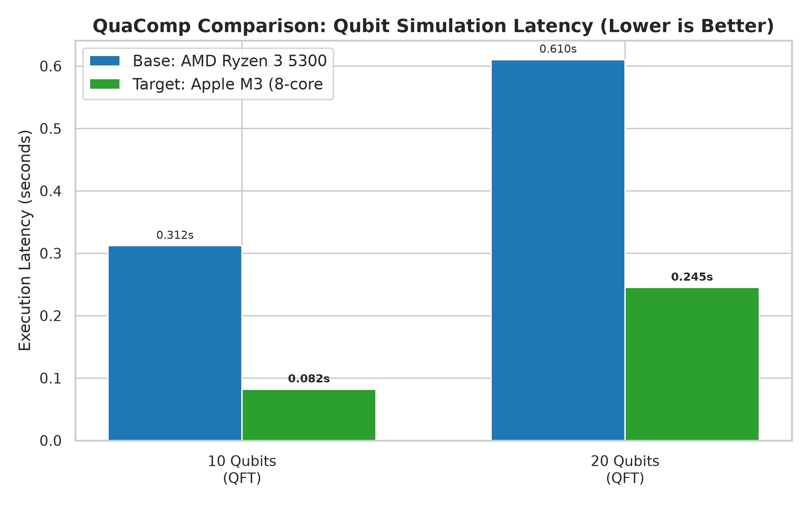
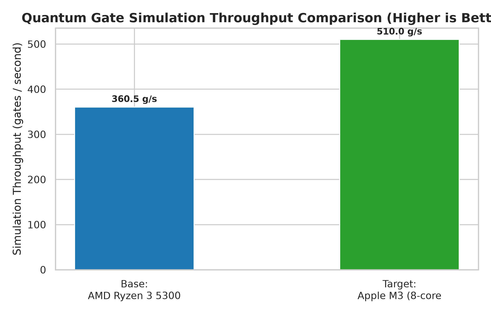

# QuaComp Relative Benchmark Comparison Report

> **Generated on**: 2026-08-21 21:03:14  
> **Base Configuration**: `AMD Ryzen 3 5300U with Radeon Graphics`  
> **Target Configuration**: `Apple M3 (8-core CPU)`

## 1. Executive Summary & Verdict

**Verdict**: Apple M3 (8-core CPU) demonstrates 1.41x faster simulation throughput (+41.5%) with a +5 qubit capacity advantage (2^5x statevector space) compared to AMD Ryzen 3 5300U with Radeon Graphics.

| Metric | Base System (`AMD Ryzen 3 5300U `) | Target System (`Apple M3 (8-core C`) | Relative Comparison / Speedup |
| :--- | :---: | :---: | :---: |
| **Composite Score** | 10,486,120.5 | 335,544,830.0 | **+3099.9%** (32.00x) |
| **Performance Tier** | High-Performance | Extreme Workstation | — |
| **Max Qubit Limit** | 20 Qubits | 25 Qubits | **+5 Qubits** (32x space) |
| **Capacity Metric ($C=2^n$)** | 1,048,576 | 33,554,432 | **32.00x Capacity** |
| **Throughput ($T=G/t$)** | 360.47 g/s | 510.00 g/s | **1.41x Speedup** (+41.5%) |

---

## 2. Hardware & Environment Specifications

| Specification | Base System | Target System |
| :--- | :--- | :--- |
| **CPU / Processor** | AMD Ryzen 3 5300U with Radeon Graphics | Apple M3 (8-core CPU) |
| **GPU Hardware** | None detected | None detected |
| **Physical RAM** | 11.3 GB | 24.0 GB |
| **Operating System** | Windows (11) | Darwin (23.4.0) |
| **Python Version** | 3.13.3 | 3.12.2 |

---

## 3. Per-Qubit Latency & Execution Breakdown

| Qubits | Workload / Method | Base Latency | Target Latency | Latency Delta (%) | Speedup Factor | CPU Usage (Base vs Target) |
| :---: | :---: | :---: | :---: | :---: | :---: | :---: |
| 10 | QFT (statevector) | 0.3120s | 0.0820s | **-73.7%** | **3.80x Faster** | 82.8% vs 92.0% |
| 20 | QFT (statevector) | 0.6103s | 0.2450s | **-59.9%** | **2.49x Faster** | 43.9% vs 89.4% |

---

## 4. Visual Comparison Plots

*(Report automatically generated by QuaComp Relative Benchmark Comparator v1.6.0)*
