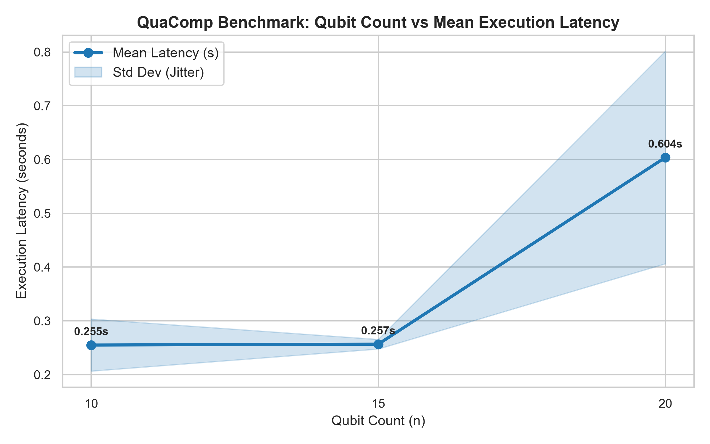
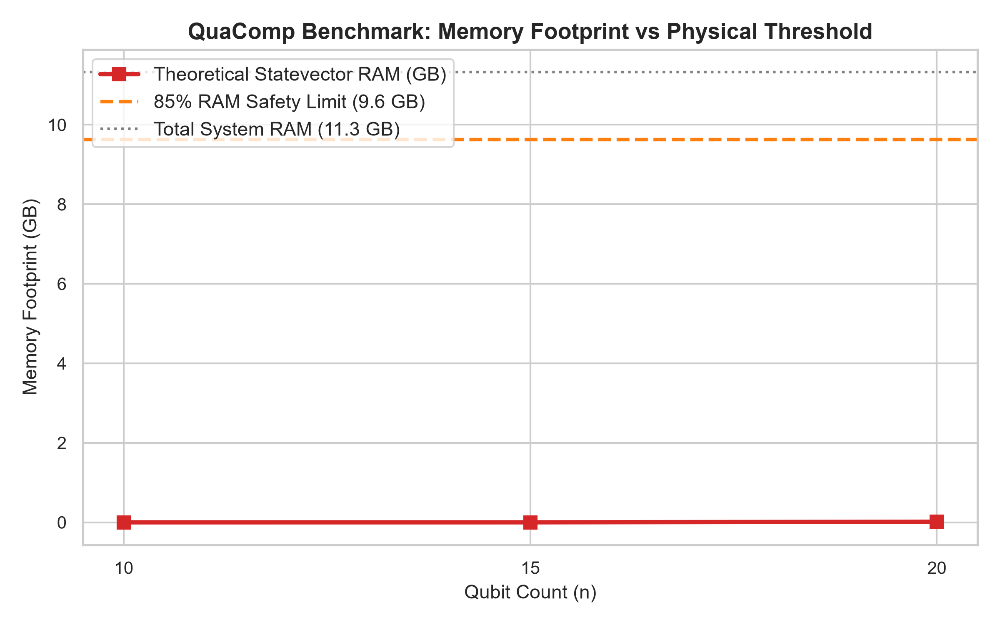

# QuaComp Benchmark Report
Generated on: `2026-08-10 20:58:31`

---

## Benchmark Summary
> **QuaComp Composite Score:** `10,486,124.36` *(Project-Specific Heuristic Score)*
> - **Capacity Metric (2^n):** `1,048,576`
> - **Throughput Metric:** `364.36 gates/sec`
> **Performance Category:** `High-Performance`
> **Simulation Method:** `Statevector`
> **Statistical Repeatability:** `3 runs` (Mean Latency: `0.6038s`, Std Dev: `0.1976s`)
> **Max Qubits Simulated:** `20 qubits` (using `220` gates)

---

## System Metadata & Telemetry
| Parameter | System Value |
| :--- | :--- |
| **CPU Name** | AMD Ryzen 3 5300U with Radeon Graphics |
| **Total Physical RAM** | 11.33 GB |
| **Operating System** | Windows (11) |
| **Python Version** | 3.13.3 |

---

## Detailed Simulation Runs
| Qubits | Method | Noise Profile | Workload | Total Gates | Latency (Mean ± Std Dev) | Fidelity % | Avg CPU % | RAM Status | Success |
| :---: | :--- | :--- | :--- | :---: | :---: | :---: | :---: | :---: | :---: |
| 10 | statevector | none | QFT | 60 | 0.2550 ± 0.0484s | 100.00% | 54.3% | SAFE | SUCCESS |
| 15 | statevector | none | QFT | 127 | 0.2567 ± 0.0090s | 100.00% | 50.9% | SAFE | SUCCESS |
| 20 | statevector | none | QFT | 220 | 0.6038 ± 0.1976s | 100.00% | 57.7% | SAFE | SUCCESS |

---

## Telemetry Visualizations

---

## GitHub Ready
This report is formatted and ready to be posted directly into GitHub Issues, pull request reviews, or Discussions.