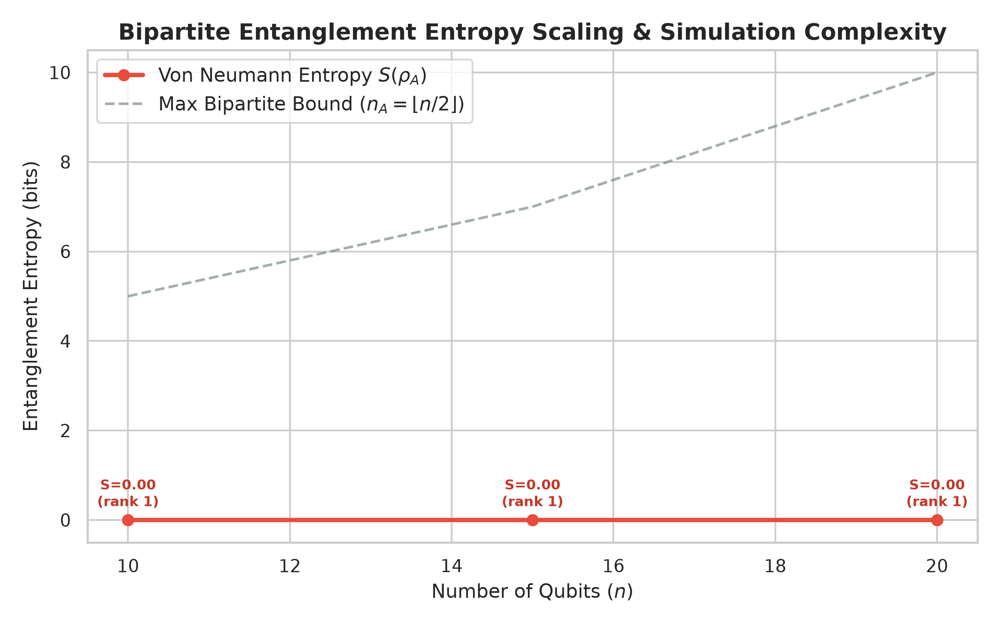

# QuaComp Benchmark Report
Generated on: `2026-08-28 15:38:50`

---

## Benchmark Summary
> **QuaComp Composite Score:** `10,486,554.18` *(Project-Specific Heuristic Score)*
> - **Capacity Metric (2^n):** `1,048,576`
> - **Throughput Metric:** `794.18 gates/sec`
> **Performance Category:** `High-Performance`
> **Simulation Method:** `Statevector`
> **Entanglement Entropy:** `S_vN = 0.0000 bits` (Schmidt Rank: `1` | `Product State`)
> **MPS Simulation Complexity:** `Trivial (chi=1)`
> **Statistical Repeatability:** `3 runs` (Mean Latency: `0.2770s`, Std Dev: `0.0266s`)
> **Max Qubits Simulated:** `20 qubits` (using `220` gates)

---

## System Metadata & Telemetry
| Parameter | System Value |
| :--- | :--- |
| **CPU Name** | AMD Ryzen 3 5300U with Radeon Graphics |
| **Total Physical RAM** | 11.33 GB |
| **Operating System** | Windows (11) |
| **Python Version** | 3.13.3 |

---

## Detailed Simulation Runs
| Qubits | Method | Noise Profile | Workload | Total Gates | Latency (Mean ± Std Dev) | Fidelity % | Avg CPU % | RAM Status | Success |
| :---: | :--- | :--- | :--- | :---: | :---: | :---: | :---: | :---: | :---: |
| 10 | statevector | none | QFT | 60 | 0.1546 ± 0.0349s | 100.00% | 89.8% | SAFE | SUCCESS |
| 15 | statevector | none | QFT | 127 | 0.1253 ± 0.0131s | 100.00% | 89.8% | SAFE | SUCCESS |
| 20 | statevector | none | QFT | 220 | 0.2770 ± 0.0266s | 100.00% | 87.5% | SAFE | SUCCESS |

---

## Entanglement Entropy & Simulation Hardness Analysis
| Qubits | Workload | Von Neumann Entropy (S_vN) | Max Bound | Schmidt Rank | Entanglement Regime | MPS Complexity Tier |
| :---: | :---: | :---: | :---: | :---: | :---: | :---: |
| 10 | QFT | 0.0000 bits | 5.0 | 1 | Product State | Trivial (chi=1) |
| 15 | QFT | 0.0000 bits | 7.0 | 1 | Product State | Trivial (chi=1) |
| 20 | QFT | 0.0000 bits | 10.0 | 1 | Product State | Trivial (chi=1) |

---

## Telemetry Visualizations

---

## GitHub Ready
This report is formatted and ready to be posted directly into GitHub Issues, pull request reviews, or Discussions.